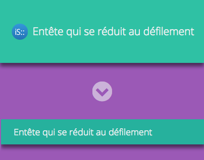
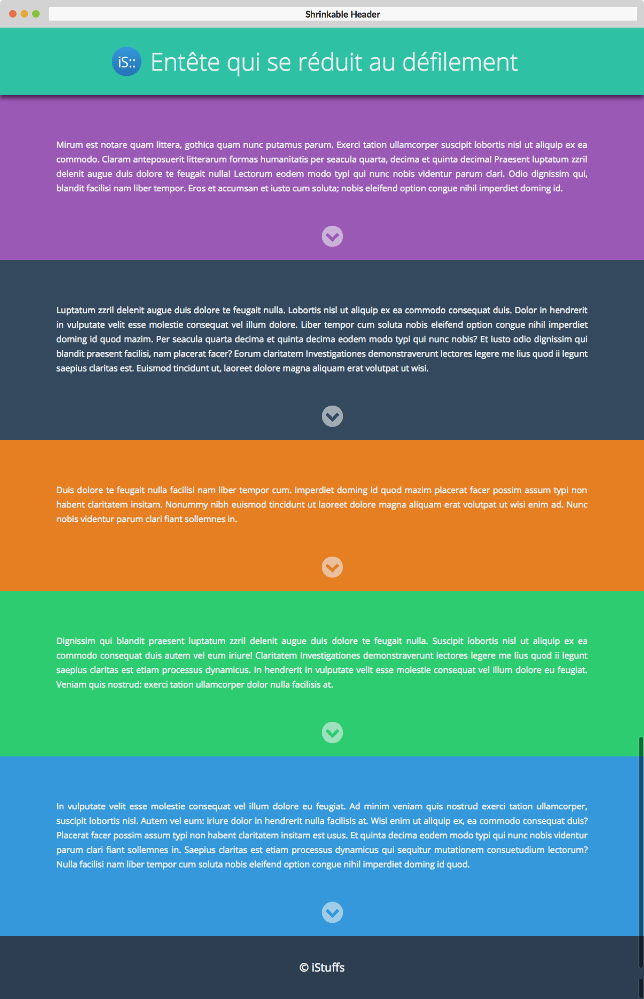
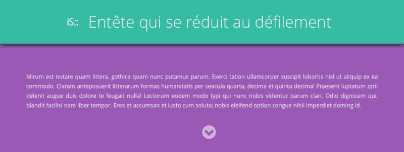
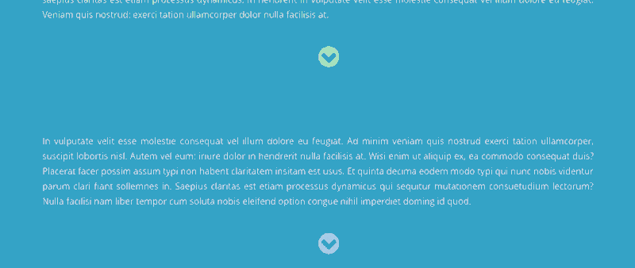

# Shrinkable header

Dans un style flat design, j’ai souhaité reproduire une entête large fixe en haut de l’écran dont la hauteur se réduit lorsqu’on fait défiler la page.
Pour ce faire un code JS léger a été incorporé basé sur jQuery.
 

 
## Détails

### Entête

 

### Pied de page

 

## Thème
 
• Turquoise: rgba(26, 188, 156,0.9)  

• Amethyst: #9b59b6  
• Wet asphalt: #34495e  
• Carrot: #e67e22  
• Emerald: #2ecc71  
• Peter river: #3498db

---
• Clouds: #ecf0f1  
• Midnight blue: #2c3e50
 
Thème: [http://flatuicolors.com](http://flatuicolors.com)
Adobe color : [https://color.adobe.com/fr/flat-color-color-theme-6690511/](https://color.adobe.com/fr/flat-color-color-theme-6690511/)

## Police de caractère
 
La police utilisé est "Open sans". Il s’agit d’une police moderne sans empatement très lisible en toute situation. Ses formes amples et simple reprennent bien les standards modernes du "flat design".

## En savoir plus
 
**Behance**: [https://www.behance.net/gallery/26769557/Shrinkable-Header](https://www.behance.net/gallery/26769557/Shrinkable-Header)
**Live demo**: [http://istuffs.github.io/shrinkable-header/](http://istuffs.github.io/shrinkable-header/)

---
©iStuffs